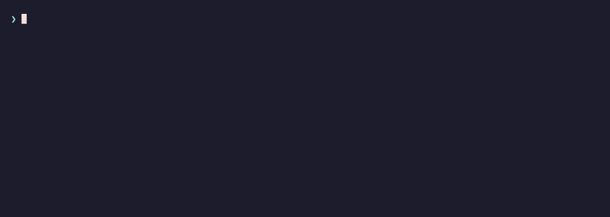

# Mirage

[](https://github.com/raphkoebraam/Mirage/actions/workflows/ci.yml)
[](LICENSE)

> Codename **Mirage**: a simulated image that behaves like the real thing.

Mirage is a friendly, scriptable command-line tool for Apple simulators. It sits on top of `xcrun simctl` and removes the parts that slow you down: copy-pasting UDIDs, remembering inconsistent subcommand names, and squinting at walls of text. You talk to simulators the way you think about them, by name, and Mirage works out the rest.

<p align="center">
  
</p>

```console
$ mirage boot "iphone 17 pro"        # names, not UDIDs
$ mirage create --type "iphone 17 pro"   # newest runtime picked, named "iPhone 17 Pro"
$ mirage screenshot                  # the booted device, timestamped filename for free
$ mirage list --json | jq '.[].udid' # scripting-friendly everywhere
```

## Why

`simctl` can do almost anything, but it makes you work for it. It wants exact UDIDs. Its ~40 subcommands follow three different naming conventions (`get_app_container`, `pbcopy`, `status_bar`). Creating a device means typing out identifiers like `com.apple.CoreSimulator.SimDeviceType.iPhone-17-Pro`. And when something goes wrong, the errors rarely tell you what to do instead.

Mirage takes a different approach. Anywhere a command wants a `<device>`, you can pass a name, a unique part of a name, a UDID, the first few characters of a UDID, or simply `booted`. The device is always the only positional argument (everything else is a named option such as `--bundle-id` or `--name`), and you can leave it out entirely to target the booted simulator. If your query matches several devices, Mirage prefers the booted one, then the one on the newest runtime. If it genuinely can't decide, it shows you the candidates instead of guessing. The same forgiveness applies to runtimes: `--runtime 18` means iOS 18.0 when that release is installed, and when a version is not installed Mirage offers the closest match that your device can actually run, so you never hit simctl's bare "Incompatible device" error.

There's also a small layer of quality-of-life on top: a `cleanup` command that shows you exactly what it wants to delete (and how much disk you'll get back) before touching anything, a `disk-usage` report, a `doctor` for sanity checks, and pretty tables everywhere, with `--json` next to them whenever you'd rather pipe to `jq`.

## Installation

Mirage ships as a single universal binary (Apple silicon and Intel) and needs **macOS 15 or newer**. It has no runtime dependencies beyond what macOS already provides; Xcode is only required for the simulators themselves.

### With Homebrew

```bash
brew install raphkoebraam/tap/mirage
```

Shell completions for zsh, bash, and fish are installed along with the binary.

### With mise

If you use [mise](https://mise.jdx.dev), installing Mirage is one line, and it pulls the binary straight from the latest GitHub release:

```bash
mise use -g github:raphkoebraam/Mirage
```

### From a release archive

Grab `mirage-<version>-macos.tar.gz` from the [releases page](https://github.com/raphkoebraam/Mirage/releases), verify it against the published `.sha256`, and move the binary somewhere on your `PATH`:

```bash
shasum -a 256 -c mirage-<version>-macos.tar.gz.sha256
tar -xzf mirage-<version>-macos.tar.gz
sudo mv mirage /usr/local/bin/
```

### From source

```bash
git clone git@github.com:raphkoebraam/Mirage.git && cd Mirage
mise install          # tuist, swiftformat, swiftlint (pinned)
mise run generate     # tuist install + tuist generate
mise run build        # Release build → ./bin/mirage
./bin/mirage --version
```

Then put `mirage` on your `PATH`. A symlink works best when you're building from source, since every `mise run build` refreshes the installed command:

```bash
sudo ln -sf "$PWD/bin/mirage" /usr/local/bin/mirage
```

If you'd rather have a stable copy, `sudo cp bin/mirage /usr/local/bin/` does it. You can also skip sudo entirely by copying the binary into `~/.local/bin` and adding that directory to `PATH` in your shell profile. Either way, `which mirage && mirage --version` confirms it worked.

Build products stay inside the repo: DerivedData goes to `build/` and the release binary lands in `bin/mirage`, both git-ignored. Building from source needs Xcode 26 or newer.

### Shell completions

Homebrew wires these up for you. With any other install method, `mirage completions <shell>` prints the script and you decide where it goes:

```bash
mirage completions zsh > "${fpath[1]}/_mirage"          # zsh
mirage completions bash > /usr/local/etc/bash_completion.d/mirage
mirage completions fish > ~/.config/fish/completions/mirage.fish
```

## Commands

Mirage covers the full simctl surface: device lifecycle, apps, screenshots and video, push notifications, privacy permissions, status bar overrides, location, pasteboard, watch pairing, runtime management, and log streaming. On top of that it adds a few things simctl doesn't have, like `cleanup`, `disk-usage`, `doctor`, and shell completions.

The **[command reference](docs/commands.md)** documents every command with its exact options. For a taste of the ones people reach for most:

```console
$ mirage cleanup --dry-run           # see what's safe to delete, and how much space it frees
$ mirage app launch --bundle-id com.example.app --console
$ mirage statusbar demo              # 9:41, full battery, full bars
$ mirage push --bundle-id com.example.app --message "Hello!"
$ mirage runtime available            # what Apple offers, and what is already installed
$ mirage runtime install iOS --version 26.2
```

And every command answers `--help`.

## Scripting and automation

Mirage is built to behave well in scripts and CI:

- **Exit codes are honest**: `0` on success, simctl's own code when it fails, `64` for usage errors.
- **Destructive commands never run unattended by accident.** `erase`, `delete`, `cleanup`, and friends ask for confirmation when a terminal is attached, and refuse to proceed without `--yes` when one isn't, so a CI job has to opt in explicitly.
- **`--json` is available on the listing commands** and emits stable, pretty-printed output.
- **Data goes to stdout, decoration doesn't.** UDIDs, paths, and pasteboard contents print plainly so pipes stay clean; spinners and alerts are kept out of the way.
- **`MIRAGE_DEVICE_SET=/path`** routes every simctl call through `--set`, giving CI jobs an isolated CoreSimulator device set that never touches your personal simulators.

## Troubleshooting

### A simulator is missing from Xcode's destination menu

Things to check, in order:

1. Open the destination menu in Xcode's toolbar and clear the **Filter** field at the top; a leftover filter hides everything that does not match.
2. Choose **Manage Run Destinations...** at the bottom of that menu, or open Window > Devices and Simulators > Simulators. Each simulator has a **Show run destination** setting: **Automatic** (the default) lets Xcode decide whether to offer it, **Always** forces it into the menu, **Never** hides it.
3. The menu only lists simulators the active scheme can run: the platform must match and the runtime must satisfy the target's deployment target. `mirage list` shows each device's runtime.
4. If Xcode still shows a device that was deleted, or hides one that exists, restart Xcode; it caches the device list.

`mirage cleanup` keeps the most recently used copy of a duplicate (then the one with the most data), so the device you were working with survives.

## Development

```bash
mise install          # tuist, swiftformat, swiftlint (pinned)
mise run generate     # tuist install + tuist generate --no-open
mise run test         # both suites, DerivedData in ./build
mise run lint         # swiftformat --lint + swiftlint
mise run format       # apply swiftformat
```

You only need to regenerate when `Project.swift`, `Tuist/Package.swift`, or the dependency graph changes; otherwise just iterate with `mise run test`. To scope a run to a single suite:

```bash
xcodebuild test -workspace Mirage.xcworkspace -scheme MirageCLITests \
  -destination platform=macOS -derivedDataPath build \
  -only-testing 'MirageCLITests/AppCommandTests'
```

The whole suite runs in well under a second and never touches a real simulator: tests inject a mock command runner and assert the exact `simctl` arguments produced. A single seam (`CommandRunning`) touches the operating system; everything above it (the typed `Simctl` client, the inventory models, the device resolver) is pure and hermetically tested.

## Contributing

Bug reports, feature ideas, and pull requests are all very welcome. See **[CONTRIBUTING.md](CONTRIBUTING.md)** for how the project works and how to get set up. If you'd rather talk something through first, opening an issue is never the wrong move.

## License

MIT. See [LICENSE](LICENSE).
